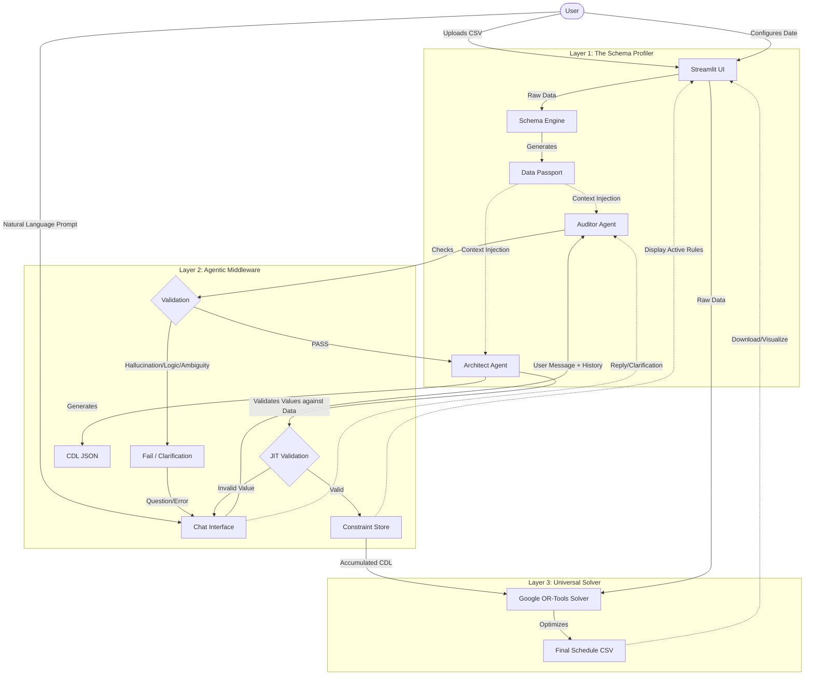

# Universal Migration Planner - System Architecture

This document details the 3-Layer Architecture of the Universal Migration Planner (UAMP), reflecting the final implementation of the Agentic Middleware, Chat Interface, and Solver integration.

## High-Level Data Flow

## Detailed Component Interaction

### 1. Data Ingestion & Profiling
*   **Input**: User uploads a CSV file (any schema).
*   **Process**: `SchemaEngine.generate_passport(df)` scans the data.
    *   **Categorical**: Lists unique values if cardinality < 50 (e.g., Regions).
    *   **Numeric**: Identifies Min/Max ranges (e.g., DB_SIZE).
*   **Output**: The **Data Passport** string, which anchors all LLM agents to the "Physical Reality" of the dataset.

### 2. The Agentic Middleware (Chat Loop)
The core interaction happens in `app.py`, orchestrating two agents:

#### A. The Auditor (`auditor.py`)
*   **Role**: Gatekeeper. Prevents invalid or ambiguous requests from reaching the Architect.
*   **Inputs**:
    *   User Input
    *   Data Passport (Reality)
    *   Existing Constraints (Rules)
    *   Chat History (Context)
    *   Plan Start Date (Time Anchor)
*   **Checks**:
    1.  **Hallucination**: "Select column 'Unicorn'" -> FAIL (Column doesn't exist).
    2.  **Logic**: "Start Jan 2026" vs "Blackout Jan 2026" -> FAIL (Contradiction).
    3.  **Ambiguity**: "Move large ones" -> CLARIFICATION_NEEDED ("Define 'large'?").
*   **The Loop**: If clarification is needed, the Auditor asks a question. The user's reply is fed back into the Auditor *with the chat history*, allowing it to resolve the ambiguity.

#### B. The Architect (`architect.py`)
*   **Role**: Translator. Converts validated intent into strict CDL.
*   **Inputs**: Same as Auditor.
*   **Process**:
    *   **Context Awareness**: Uses history to merge original intent with clarifications.
    *   **Date Calculation**: Maps relative dates ("Jan 2027") to integer indices based on `Plan Start Date`.
    *   **Grammar Enforcement**: Uses Few-Shot examples to generate nested CDL (`IMPLIES`, `AND`) and generic Solver functions (`ALL_MEMBERS_HAVE_SAME_VALUE`).
    *   **JIT Validation**: Before returning, checks generated values against the DataFrame (using `rapidfuzz` for fuzzy matching) to catch any remaining hallucinations.

### 3. The Universal Solver (`solver.py`)
*   **Role**: Execution Engine.
*   **Mechanism**: Google OR-Tools (CP-SAT).
*   **Integration**:
    *   Receives the generic CDL JSON.
    *   Maps CDL buckets (Filtering, Temporal, Aggregation, Cohesion) to CP-SAT constraints.
    *   **Generic Functions**:
        *   `ALL_MEMBERS_HAVE_SAME_VALUE`: Enforces group cohesion.
        *   `GET_POD_COUNT_FOR_MONTH`: Enforces global capacity limits.
*   **Output**: An optimized schedule respecting all constraints.
