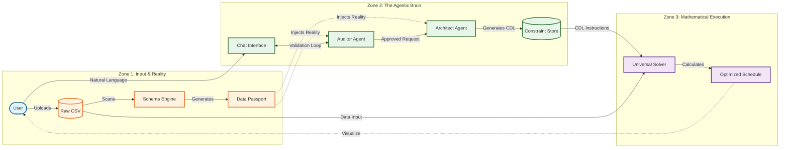

# Universal Migration Planner - System Architecture

This document outlines the **Logical Architecture** of the Universal Migration Planner (UAMP). It illustrates how human intent is transformed into mathematical execution through an intelligent, schema-aware middleware layer.

## The 3-Layer Logic Flow

## Core Components

### 1. Context Engine (The "Eyes")
*   **Purpose**: To ground the LLM in reality.
*   **Mechanism**: The **Schema Engine** profiles the uploaded data, creating a **Data Passport** (summary of columns, ranges, and unique values).
*   **Benefit**: Prevents hallucinations by ensuring agents only reference columns and values that actually exist.

### 2. Intelligent Middleware (The "Brain")
*   **The Auditor**: A gatekeeper that ensures requests are logical and unambiguous.
    *   *Example*: Fails "Start in Jan 2025" if "Blackout Jan 2025" exists.
*   **The Architect**: A translator that converts approved English requests into **Constraint Definition Language (CDL)**.
    *   *Feature*: Uses "Few-Shot Learning" to construct complex nested logic (e.g., `IMPLIES`, `AND`) and maps relative dates (e.g., "Next Month") to absolute indices.

### 3. Execution Core (The "Hands")
*   **Universal Solver**: A Google OR-Tools (CP-SAT) engine.
*   **Mechanism**: It is "blind" to business logic. It simply executes the mathematical instructions (CDL) generated by the Architect against the raw data.
